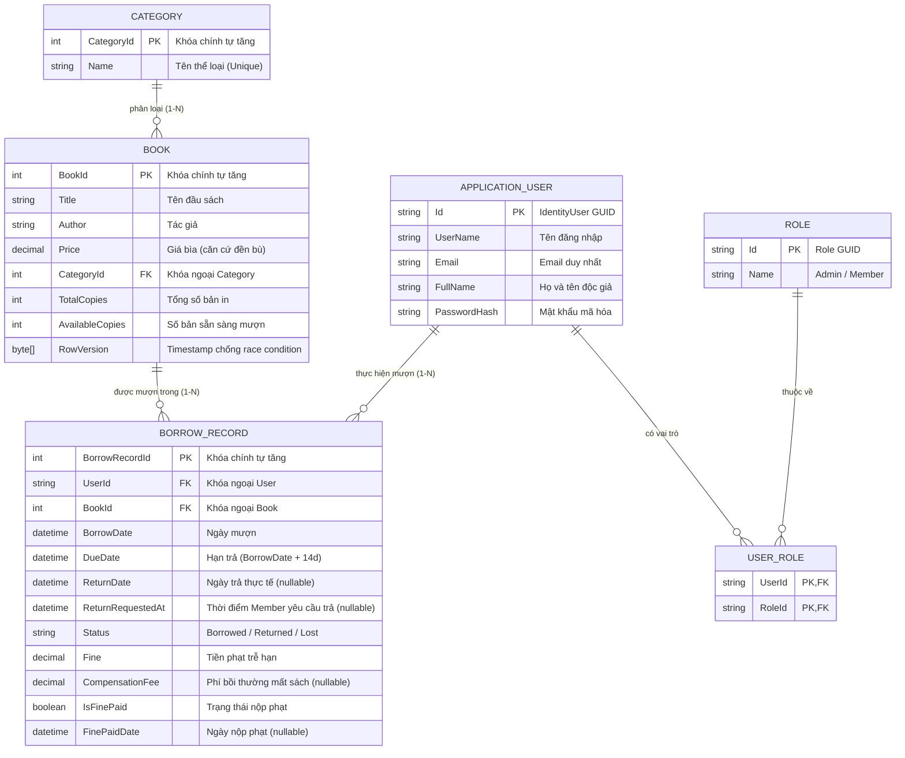
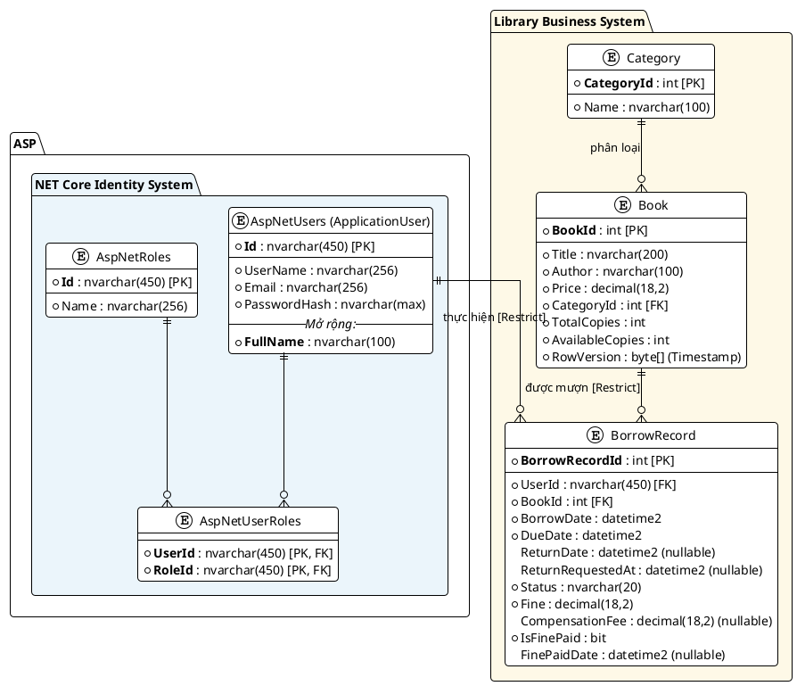
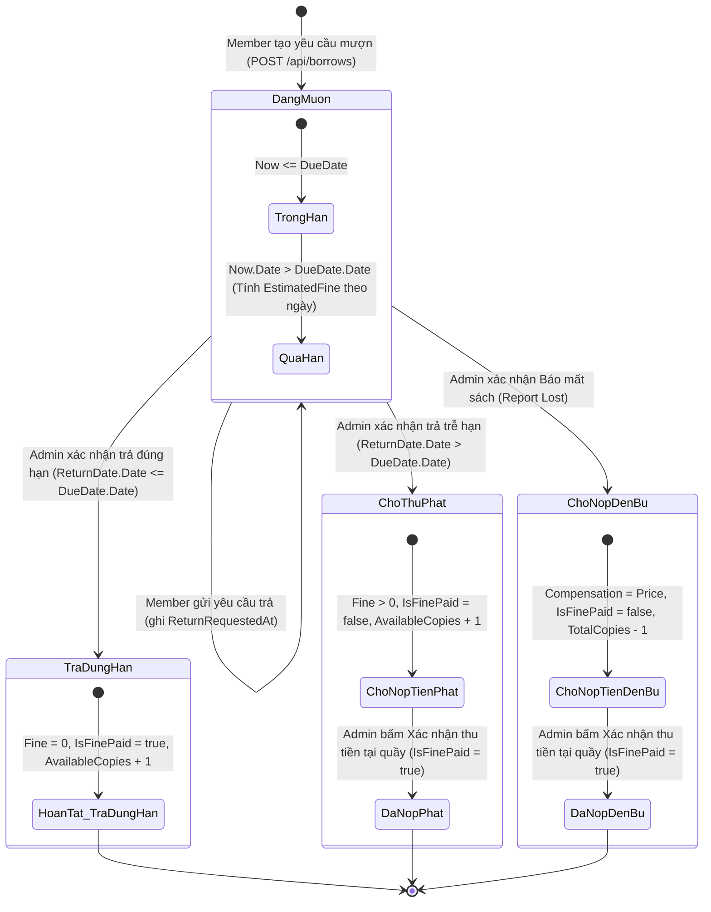
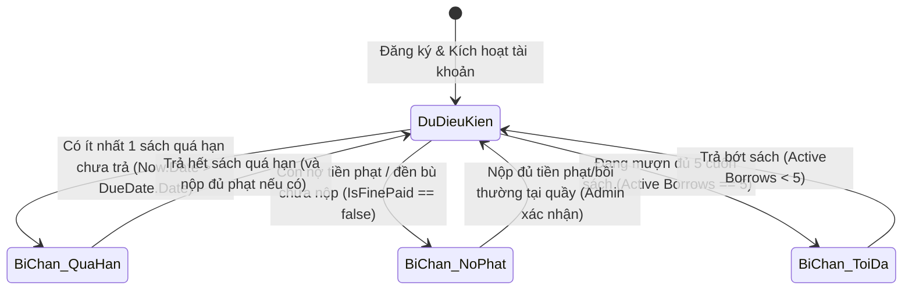

**TÀI LIỆU ĐẶC TẢ DỰ ÁN**

**Library Management System**

*Hệ thống Quản lý Thư viện — Đồ án cuối kỳ ASP.NET Web API & Client (.NET 8)*

---

# 1. Giới thiệu

**Library Management System** là hệ thống quản lý thư viện trực tuyến cho phép quản trị viên (Admin/Thủ thư) quản lý danh mục sách, thể loại sách, theo dõi và xử lý quy trình mượn/trả sách, thu tiền phạt và xử lý bồi thường khi mất sách. Đồng thời, hệ thống cho phép độc giả (Member) tra cứu sách, gửi yêu cầu mượn sách trực tuyến và theo dõi lịch sử mượn cũng như các khoản phí phạt phát sinh theo thời gian thực.

Hệ thống được xây dựng theo kiến trúc RESTful API với **ASP.NET Core Web API** ở Backend và **ASP.NET Core MVC** ở Frontend, sử dụng **JWT (JSON Web Token)** kết hợp **ASP.NET Core Identity** để xác thực và phân quyền người dùng.

### Mục tiêu chính của hệ thống

- Quản lý tập trung danh mục sách, giá tiền bìa sách và thể loại sách.
- Tự động hóa quy trình mượn sách, kiểm soát số lượng sách khả dụng (`AvailableCopies`) theo thời gian thực và chống tranh chấp dữ liệu (Race Condition).
- Quy trình trả sách, báo mất sách và thu tiền phạt minh bạch, chặt chẽ tại quầy thư viện do Quản trị viên/Thủ thư xác nhận.
- Tự động tính toán phí phạt trễ hạn theo thời gian thực và tự động chặn mượn sách đối với độc giả có sách quá hạn hoặc chưa hoàn thành nghĩa vụ tài chính.

---

# 2. Danh sách Actor (Người dùng hệ thống)

| **Actor**                                | **Vai trò và quyền hạn**                                                                                                                                                                                                                                                                                                  |
| ---------------------------------------------- | ----------------------------------------------------------------------------------------------------------------------------------------------------------------------------------------------------------------------------------------------------------------------------------------------------------------------------------- |
| **Admin (Thủ thư / Quản trị viên)** | Quản trị viên hệ thống và vận hành quầy thư viện. Toàn quyền CRUD Sách và Thể loại; xem toàn bộ lịch sử mượn/trả của mọi thành viên; thực hiện xác nhận nhận lại sách tại quầy (Return); ghi nhận báo mất sách (Report Lost); xác nhận thu tiền phạt / tiền bồi thường (Pay Fine). |
| **Member (Độc giả / Thành viên)**   | Thành viên thư viện đã đăng ký và đăng nhập. Tra cứu danh mục sách; thực hiện mượn sách trực tuyến; xem danh sách sách đang mượn kèm số tiền phạt tạm tính; xem lịch sử mượn/trả và trạng thái các khoản phạt/bồi thường của bản thân.                                           |
| **Khách (Guest / Chưa đăng nhập)**  | Xem danh sách và tra cứu thông tin sách công khai; phải đăng ký/đăng nhập tài khoản Member để thực hiện mượn sách.                                                                                                                                                                                            |

---

# 3. Sơ đồ thực thể quan hệ (ERD & Data Model)

Hệ thống được thiết kế theo mô hình **Code-First với ASP.NET Core Identity và Entity Framework Core 8**, bao gồm 2 phân hệ thực thể chính:

1. **Phân hệ Identity (Xác thực & Phân quyền)**: `AspNetUsers` (kế thừa qua `ApplicationUser`), `AspNetRoles`, `AspNetUserRoles`.
2. **Phân hệ Nghiệp vụ Thư viện (Library Business)**: `Category`, `Book`, `BorrowRecord`.

---

## 3.1. Sơ đồ ERD trực quan (Mermaid Diagram)

---

## 3.2. Sơ đồ ERD chi tiết (PlantUML)

File nguồn PlantUML được lưu tại: [Erd.puml](./Erd.puml)

---

## 3.3. Chi tiết các bảng dữ liệu & Chính sách toàn vẹn

| **Bảng**           | **Trường dữ liệu**                                                                                                              | **Kiểu dữ liệu**                                                                                         | **Ghi chú & Ràng buộc toàn vẹn**                                                                                                                                                                                                                                                                                                                                                                                                                                                                                                                                           |
| ------------------------- | ----------------------------------------------------------------------------------------------------------------------------------------- | ----------------------------------------------------------------------------------------------------------------- | ------------------------------------------------------------------------------------------------------------------------------------------------------------------------------------------------------------------------------------------------------------------------------------------------------------------------------------------------------------------------------------------------------------------------------------------------------------------------------------------------------------------------------------------------------------------------------------- |
| **Category**        | `CategoryId` (PK)`Name`                                                                                                               | `intnvarchar(100)`                                                                                              | Khóa chính tự tăng.Tên thể loại là duy nhất (Unique). Không được xóa nếu còn sách tham chiếu (Restrict).                                                                                                                                                                                                                                                                                                                                                                                                                                                            |
| **Book**            | `BookId` (PK)`TitleAuthor``PriceCategoryId` (FK)`TotalCopiesAvailableCopies``RowVersion`                                            | `intnvarchar(200)``nvarchar(100)decimal(18,2)``intint``intbyte[]`                                               | Khóa chính tự tăng.Tên sách.Tác giả.Giá bìa sách (căn cứ đền bù mất sách).Khóa ngoại liên kết Category.Tổng số bản in nhập kho (TotalCopies > 0).Số bản sẵn sàng cho mượn (0 ≤ AvailableCopies ≤ TotalCopies).Concurrency token chống race condition khi cập nhật số lượng.                                                                                                                                                                                                                                                                   |
| **ApplicationUser** | `Id` (PK)`EmailFullName``Role`                                                                                                        | `nvarchar(450)nvarchar(256)``nvarchar(100)nvarchar(50)`                                                         | Kế thừa từ`IdentityUser`.Email định danh duy nhất.Họ và tên người dùng.Vai trò người dùng (`Admin` hoặc `Member`).                                                                                                                                                                                                                                                                                                                                                                                                                                             |
| **BorrowRecord**    | `BorrowRecordId` (PK)`UserId` (FK)`BookId` (FK)`BorrowDateDueDate``ReturnDateStatus``FineCompensationFee``IsFinePaidFinePaidDate` | `intnvarchar(450)``intdatetime2``datetime2datetime2?``nvarchar(20)decimal(18,2)``decimal(18,2)?bit``datetime2?` | Khóa chính tự tăng.Khóa ngoại trỏ đến`ApplicationUser` (`DeleteBehavior.Restrict`).Khóa ngoại trỏ đến `Book` (`DeleteBehavior.Restrict`).Thời điểm mượn sách.Hạn chót trả sách (mặc định = BorrowDate + 14 ngày).Thời điểm thực tế trả sách (null nếu chưa trả).Trạng thái: `Borrowed`, `Returned`, `Lost`.Tiền phạt trễ hạn (mặc định 0).Phí bồi thường mất sách (= Book.Price khi Lost).Trạng thái đã nộp tiền phạt/bồi thường (mặc định false).Thời điểm Admin xác nhận thu tiền tại quầy. |

> **Bổ sung cho luồng Member trả sách:** `BorrowRecord.ReturnRequestedAt` (`datetime2?`) lưu thời điểm Member gửi yêu cầu trả. Trường này chỉ phục vụ điều phối tại quầy; không thay đổi `Status`, không dừng tính phí quá hạn và không tăng `AvailableCopies`.

---

# 4. Danh sách RESTful API

## 4.1. Auth — `/api/auth`

| **Method** | **Route**        | **Request Body**                      | **Response**                                | **Quyền** |
| ---------------- | ---------------------- | ------------------------------------------- | ------------------------------------------------- | ---------------- |
| POST             | `/api/auth/register` | `RegisterDto` {Email, Password, FullName} | 201 Created - Thông báo đăng ký thành công | Public           |
| POST             | `/api/auth/login`    | `LoginDto` {Email, Password}              | 200 OK {Token, Expiration, FullName, Role}        | Public           |

## 4.2. Category — `/api/categories`

| **Method** | **Route**          | **Request Body**       | **Response**          | **Quyền** |
| ---------------- | ------------------------ | ---------------------------- | --------------------------- | ---------------- |
| GET              | `/api/categories`      | —                           | 200 OK`List<CategoryDto>` | Public           |
| GET              | `/api/categories/{id}` | —                           | 200 OK`CategoryDto`       | Public           |
| POST             | `/api/categories`      | `CreateCategoryDto` {Name} | 201 Created`CategoryDto`  | Admin            |
| PUT              | `/api/categories/{id}` | `UpdateCategoryDto` {Name} | 204 No Content              | Admin            |
| DELETE           | `/api/categories/{id}` | —                           | 204 No Content              | Admin            |

## 4.3. Book — `/api/books`

| **Method** | **Route**                                    | **Request Body**                                            | **Response**             | **Quyền** |
| ---------------- | -------------------------------------------------- | ----------------------------------------------------------------- | ------------------------------ | ---------------- |
| GET              | `/api/books?search=&categoryId=&page=&pageSize=` | —                                                                | 200 OK`PagedResult<BookDto>` | Public           |
| GET              | `/api/books/{id}`                                | —                                                                | 200 OK`BookDto`              | Public           |
| POST             | `/api/books`                                     | `CreateBookDto` {Title, Author, Price, CategoryId, TotalCopies} | 201 Created`BookDto`         | Admin            |
| PUT              | `/api/books/{id}`                                | `UpdateBookDto` {Title, Author, Price, CategoryId, TotalCopies} | 204 No Content                 | Admin            |
| DELETE           | `/api/books/{id}`                                | —                                                                | 204 No Content                 | Admin            |

## 4.4. Borrow & Return — `/api/borrows`

| **Method** | **Route**                                              | **Request Body**        | **Response**                                         | **Quyền** |
| ---------------- | ------------------------------------------------------------ | ----------------------------- | ---------------------------------------------------------- | ---------------- |
| POST             | `/api/borrows`                                             | `BorrowRequestDto` {BookId} | 201 Created`BorrowRecordDto`                             | Member           |
| PUT              | `/api/borrows/{id}/request-return`                         | —                            | 200 OK `BorrowRecordDto` (ghi nhận `ReturnRequestedAt`)  | Owner / Member   |
| PUT              | `/api/borrows/{id}/return`                                 | —                            | 200 OK`BorrowRecordDto` (cập nhật Fine nếu trễ hạn) | Admin            |
| PUT              | `/api/borrows/{id}/report-lost`                            | —                            | 200 OK`BorrowRecordDto` (tính CompensationFee)          | Admin            |
| PUT              | `/api/borrows/{id}/pay-fine`                               | —                            | 200 OK`BorrowRecordDto` (IsFinePaid = true)              | Admin            |
| GET              | `/api/borrows/my`                                          | —                            | 200 OK`List<BorrowRecordDto>` (kèm `EstimatedFine`)   | Member           |
| GET              | `/api/borrows?userId=&status=&isFinePaid=&page=&pageSize=` | —                            | 200 OK`PagedResult<BorrowRecordDto>`                     | Admin            |
| GET              | `/api/borrows/{id}`                                        | —                            | 200 OK`BorrowRecordDto`                                  | Owner / Admin    |

---

## 4.5. Logic nghiệp vụ cốt lõi tại Backend

### 1. Khi tạo lượt mượn (`POST /api/borrows`)

- Trích xuất `UserId` từ JWT Token của Member đang đăng nhập.
- Kiểm tra tính hợp lệ của Member:
  - Member không được có bất kỳ sách nào đang ở trạng thái trễ hạn (`Status == Borrowed && Now.Date > DueDate.Date`).
  - Member không được có bất kỳ khoản nợ phạt / bồi thường nào chưa thanh toán (`(Fine > 0 || CompensationFee > 0) && IsFinePaid == false`).
  - Số lượng sách đang mượn (`Status == Borrowed`) của Member không vượt quá giới hạn tối đa (5 cuốn).
- Kiểm tra `Book.AvailableCopies > 0`.
- Thực hiện trong Database Transaction:
  - Giảm `Book.AvailableCopies` đi 1.
  - Tạo `BorrowRecord`: `BorrowDate = Now`, `DueDate = Now + 14 ngày`, `Status = Borrowed`, `Fine = 0`, `IsFinePaid = false`.

### 2. Khi Member gửi yêu cầu trả sách (`PUT /api/borrows/{id}/request-return`)

- Chỉ Member sở hữu `BorrowRecord` mới được gửi yêu cầu.
- Chỉ chấp nhận khi `Status == Borrowed`; gọi lại cùng yêu cầu là idempotent và không tạo thông báo trùng.
- Ghi nhận `ReturnRequestedAt = Now` và thông báo cho Admin để ưu tiên xử lý tại quầy.
- **Không** đổi `Status`, **không** ghi `ReturnDate`, **không** tăng `AvailableCopies` và **không** đóng băng phí trễ hạn.
- Member vẫn phải mang sách vật lý đến quầy; `ReturnDate` chỉ được ghi khi Admin thực sự nhận sách.

### 3. Khi xác nhận trả sách tại quầy (`PUT /api/borrows/{id}/return`)

- Kiểm tra `BorrowRecord` tồn tại và đang ở trạng thái `Status == Borrowed`.
- Ghi nhận `ReturnDate = Now`.
- Tính phí phạt trễ hạn:
  - Nếu `ReturnDate.Date > DueDate.Date`: `Fine = min(Book.Price, số ngày trễ * 5.000đ)`.
  - Nếu `ReturnDate.Date <= DueDate.Date`: `Fine = 0`.
- Nếu `Fine == 0` thì `IsFinePaid = true`. Ngược lại nếu `Fine > 0` thì `IsFinePaid = false`.
- Cập nhật `Status = Returned`.
- Tăng `Book.AvailableCopies` lên 1.

### 4. Khi xác nhận báo mất sách tại quầy (`PUT /api/borrows/{id}/report-lost`)

- Kiểm tra `BorrowRecord` tồn tại và đang ở trạng thái `Status == Borrowed`.
- Ghi nhận `Status = Lost`.
- Tính phí phạt trễ hạn tính đến ngày báo mất (nếu ngày hiện tại đã quá `DueDate`).
- Gán phí bồi thường `CompensationFee = Book.Price`.
- Gán `IsFinePaid = false`.
- Giảm vĩnh viễn `Book.TotalCopies` đi 1 (sách bị loại bỏ khỏi thư viện, không tăng `AvailableCopies`).

### 5. Khi xác nhận thu tiền phạt / bồi thường tại quầy (`PUT /api/borrows/{id}/pay-fine`)

- Kiểm tra `BorrowRecord` có nghĩa vụ tài chính chưa hoàn thành (`(Fine > 0 || CompensationFee > 0) && IsFinePaid == false`).
- Cập nhật `IsFinePaid = true` và `FinePaidDate = Now`.

---

# 5. Use Case Specifications

## 5.1. Danh sách tổng hợp Use Case

| **Mã UC** | **Tên Use Case**                                       | **Actor(s)**                    | **Độ ưu tiên** |
| ---------------- | ------------------------------------------------------------- | ------------------------------------- | ------------------------ |
| **UC-01**  | Đăng ký tài khoản (Register Account)                     | Khách (Guest) — primary             | Must Have                |
| **UC-02**  | Đăng nhập hệ thống (Login System)                        | Member, Admin — primary              | Must Have                |
| **UC-03**  | Quản lý sách (Manage Book)                                 | Admin — primary                      | Must Have                |
| **UC-04**  | Quản lý thể loại (Manage Category)                        | Admin — primary                      | Should Have              |
| **UC-05**  | Tìm kiếm & Xem sách (Search Book)                          | Khách (Guest), Member — primary     | Must Have                |
| **UC-06**  | Mượn sách trực tuyến (Borrow Book)                       | Member — primary                     | Must Have                |
| **UC-07**  | Yêu cầu & Xác nhận trả sách (Request & Confirm Return)  | Member, Admin — primary             | Must Have                |
| **UC-08**  | Xem lịch sử mượn & Phạt tạm tính (View Borrow History) | Member — primary                     | Must Have                |
| **UC-09**  | Quản lý các bản ghi mượn (Manage Borrow Records)        | Admin — primary                      | Should Have              |
| **UC-10**  | Xử lý báo mất sách & Bồi thường (Report Lost Book)    | Admin — primary, Member — secondary | Must Have                |
| **UC-11**  | Xác nhận thu tiền phạt / Bồi thường (Collect Payment)  | Admin — primary                      | Must Have                |

---

## 5.2. Chi tiết Use Case Specification

### 5.2.1. UC-01 — Đăng ký tài khoản (Register Account)

| **Đăng ký tài khoản (Register Account)** |                                                                                                                                                                                                                                                                                                                                            |
| --------------------------------------------------- | ------------------------------------------------------------------------------------------------------------------------------------------------------------------------------------------------------------------------------------------------------------------------------------------------------------------------------------------ |
| **Mã Use Case**                              | UC-01                                                                                                                                                                                                                                                                                                                                      |
| **Actor(s)**                                  | Khách (Guest) — primary                                                                                                                                                                                                                                                                                                                  |
| **Mô tả tóm tắt**                         | Cho phép khách tạo tài khoản Member mới để sử dụng chức năng mượn sách.                                                                                                                                                                                                                                                     |
| **Độ ưu tiên**                            | Must Have                                                                                                                                                                                                                                                                                                                                  |
| **Tiền điều kiện**                        | • Người dùng chưa đăng nhập• Email chưa từng được đăng ký trong hệ thống                                                                                                                                                                                                                                                |
| **Hậu điều kiện**                         | • Tài khoản mới được tạo trong`ApplicationUser` với Role mặc định là `Member`                                                                                                                                                                                                                                             |
| **Luồng cơ bản (Basic Path)**              | 1. Khách chọn chức năng Đăng ký trên giao diện/gọi API2. Nhập Email, Password, FullName và gửi yêu cầu3. Hệ thống kiểm tra định dạng email, độ mạnh mật khẩu và tính duy nhất của Email4. Hệ thống tạo tài khoản mới với vai trò`Member`5. Hệ thống trả về thông báo đăng ký thành công |
| **Luồng thay thế (Alternative Paths)**      | 3a. Email không đúng định dạng hoặc đã tồn tại → Báo lỗi tương ứng3b. Password không đủ mạnh (dưới 6 ký tự, thiếu hoa/thường/số) → Báo lỗi                                                                                                                                                                 |
| **Quy tắc nghiệp vụ**                      | BR-01, BR-02, BR-03                                                                                                                                                                                                                                                                                                                        |
| **Yêu cầu phi chức năng**                 | Thời gian phản hồi < 2s; Mật khẩu được mã hóa (Hash) an toàn bằng ASP.NET Identity                                                                                                                                                                                                                                             |

---

### 5.2.2. UC-02 — Đăng nhập hệ thống (Login System)

| **Đăng nhập hệ thống (Login System)** |                                                                                                                                                                                                          |
| ------------------------------------------------ | -------------------------------------------------------------------------------------------------------------------------------------------------------------------------------------------------------- |
| **Mã Use Case**                           | UC-02                                                                                                                                                                                                    |
| **Actor(s)**                               | Member, Admin — primary                                                                                                                                                                                 |
| **Mô tả tóm tắt**                      | Xác thực người dùng và cấp phát JWT token phục vụ phân quyền truy cập.                                                                                                                      |
| **Độ ưu tiên**                         | Must Have                                                                                                                                                                                                |
| **Tiền điều kiện**                     | • Người dùng đã có tài khoản hợp lệ                                                                                                                                                           |
| **Hậu điều kiện**                      | • Người dùng nhận được JWT Token chứa thông tin`UserId`, `Role`, `FullName`                                                                                                              |
| **Luồng cơ bản (Basic Path)**           | 1. Người dùng nhập Email và Password2. Hệ thống kiểm tra thông tin tài khoản3. Hệ thống sinh JWT Token kèm thời gian hết hạn (Expiration)4. Trả về Token và thông tin người dùng |
| **Luồng thay thế**                       | 2a. Sai Email hoặc Password → Thông báo lỗi chung: "Email hoặc mật khẩu không chính xác"                                                                                                      |
| **Quy tắc nghiệp vụ**                   | BR-04                                                                                                                                                                                                    |

---

### 5.2.3. UC-03 — Quản lý sách (Manage Book)

| **Quản lý sách (Manage Book)** |                                                                                                                                                                                                                                                                                                                                                    |
| --------------------------------------- | -------------------------------------------------------------------------------------------------------------------------------------------------------------------------------------------------------------------------------------------------------------------------------------------------------------------------------------------------- |
| **Mã Use Case**                  | UC-03                                                                                                                                                                                                                                                                                                                                              |
| **Actor(s)**                      | Admin — primary                                                                                                                                                                                                                                                                                                                                   |
| **Mô tả tóm tắt**             | Cho phép Admin thêm mới, cập nhật, xóa và xem danh mục sách kèm giá tiền.                                                                                                                                                                                                                                                              |
| **Độ ưu tiên**                | Must Have                                                                                                                                                                                                                                                                                                                                          |
| **Tiền điều kiện**            | • Admin đã đăng nhập với Role = Admin                                                                                                                                                                                                                                                                                                       |
| **Hậu điều kiện**             | • Dữ liệu sách được tạo mới / cập nhật / xóa trong CSDL                                                                                                                                                                                                                                                                                |
| **Luồng cơ bản (Basic Path)**  | 1. Admin truy cập danh mục Quản lý sách2. Admin chọn Thêm mới/Sửa/Xóa sách3. Khi Thêm/Sửa: Nhập Title, Author, Price, CategoryId, TotalCopies4. Hệ thống kiểm tra: CategoryId hợp lệ, Price > 0, TotalCopies > 05. Hệ thống lưu thay đổi và cập nhật AvailableCopies tương ứng6. Hiển thị thông báo thành công |
| **Luồng thay thế**              | 4a. Dữ liệu không hợp lệ → Báo lỗi chi tiết2a. Admin chọn Xóa sách đang có lượt mượn chưa hoàn tất (`Status == Borrowed`) → Từ chối xóa và báo lỗi                                                                                                                                                                   |
| **Quy tắc nghiệp vụ**          | BR-06, BR-07, BR-08, BR-09, BR-10, BR-23                                                                                                                                                                                                                                                                                                           |

---

### 5.2.4. UC-04 — Quản lý thể loại (Manage Category)

| **Quản lý thể loại (Manage Category)** |                                                                                                                                                           |
| ------------------------------------------------ | --------------------------------------------------------------------------------------------------------------------------------------------------------- |
| **Mã Use Case**                           | UC-04                                                                                                                                                     |
| **Actor(s)**                               | Admin — primary                                                                                                                                          |
| **Mô tả tóm tắt**                      | Cho phép Admin thêm mới, sửa, xóa danh mục thể loại sách.                                                                                        |
| **Độ ưu tiên**                         | Should Have                                                                                                                                               |
| **Tiền điều kiện**                     | • Admin đã đăng nhập với Role = Admin                                                                                                              |
| **Hậu điều kiện**                      | • Thông tin thể loại được lưu vào CSDL                                                                                                           |
| **Luồng cơ bản (Basic Path)**           | 1. Admin chọn chức năng Quản lý thể loại2. Admin thêm mới/sửa tên/xóa thể loại3. Hệ thống kiểm tra tên không trùng lặp và lưu CSDL |
| **Luồng thay thế**                       | 2a. Xóa thể loại đang có sách tham chiếu → Từ chối xóa và hiển thị thông báo                                                              |
| **Quy tắc nghiệp vụ**                   | BR-09, BR-23                                                                                                                                              |

---

### 5.2.5. UC-05 — Tìm kiếm & Xem sách (Search Book)

| **Tìm kiếm & Xem sách (Search Book)** |                                                                                                                                                                        |
| ---------------------------------------------- | ---------------------------------------------------------------------------------------------------------------------------------------------------------------------- |
| **Mã Use Case**                         | UC-05                                                                                                                                                                  |
| **Actor(s)**                             | Khách (Guest), Member — primary                                                                                                                                      |
| **Mô tả tóm tắt**                    | Tra cứu danh mục sách theo từ khóa tên sách, tác giả, thể loại có phân trang.                                                                             |
| **Độ ưu tiên**                       | Must Have                                                                                                                                                              |
| **Tiền điều kiện**                   | • Hệ thống có dữ liệu sách                                                                                                                                      |
| **Hậu điều kiện**                    | • Danh sách sách thỏa mãn điều kiện hiển thị kèm số lượng`AvailableCopies`                                                                             |
| **Luồng cơ bản (Basic Path)**         | 1. Người dùng nhập từ khóa tìm kiếm và/hoặc chọn Thể loại2. Hệ thống truy vấn và trả về danh sách phân trang (kèm`AvailableCopies`, `Price`) |
| **Quy tắc nghiệp vụ**                 | BR-08                                                                                                                                                                  |

---

### 5.2.6. UC-06 — Mượn sách trực tuyến (Borrow Book)

| **Mượn sách trực tuyến (Borrow Book)** |                                                                                                                                                                                                                                                                                                                                                                                                                                                                                                                                                                                                                          |
| ------------------------------------------------- | ------------------------------------------------------------------------------------------------------------------------------------------------------------------------------------------------------------------------------------------------------------------------------------------------------------------------------------------------------------------------------------------------------------------------------------------------------------------------------------------------------------------------------------------------------------------------------------------------------------------------ |
| **Mã Use Case**                            | UC-06                                                                                                                                                                                                                                                                                                                                                                                                                                                                                                                                                                                                                    |
| **Actor(s)**                                | Member — primary                                                                                                                                                                                                                                                                                                                                                                                                                                                                                                                                                                                                        |
| **Mô tả tóm tắt**                       | Cho phép Member đã đăng nhập thực hiện mượn một cuốn sách còn khả dụng.                                                                                                                                                                                                                                                                                                                                                                                                                                                                                                                                  |
| **Độ ưu tiên**                          | Must Have                                                                                                                                                                                                                                                                                                                                                                                                                                                                                                                                                                                                                |
| **Tiền điều kiện**                      | • Member đã đăng nhập thành công• Sách cần mượn có`AvailableCopies > 0`                                                                                                                                                                                                                                                                                                                                                                                                                                                                                                                                  |
| **Hậu điều kiện**                       | • Một bản ghi`BorrowRecord` mới được tạo với `Status = Borrowed`• `Book.AvailableCopies` giảm đi 1                                                                                                                                                                                                                                                                                                                                                                                                                                                                                                     |
| **Luồng cơ bản (Basic Path)**            | 1. Member chọn cuốn sách muốn mượn và nhấn "Mượn sách"2. Hệ thống kiểm tra điều kiện mượn của Member:&nbsp;&nbsp;&nbsp;&nbsp;a. Member không có sách quá hạn chưa trả&nbsp;&nbsp;&nbsp;&nbsp;b. Member không còn nợ tiền phạt/bồi thường chưa nộp&nbsp;&nbsp;&nbsp;&nbsp;c. Tổng số sách đang mượn hiện tại < 5 cuốn3. Hệ thống kiểm tra `Book.AvailableCopies > 0`4. Hệ thống tạo `BorrowRecord` (DueDate = BorrowDate + 14 ngày), giảm `AvailableCopies` đi 1 trong Database Transaction5. Thông báo mượn sách thành công và hiển thị hạn trả |
| **Luồng thay thế**                        | 2a. Đang có sách quá hạn → Báo lỗi: "Bạn đang có sách trễ hạn chưa trả, vui lòng hoàn trả sách trước khi mượn mới"2b. Đang nợ phạt → Báo lỗi: "Bạn còn khoản phạt chưa thanh toán, vui lòng nộp phạt tại quầy thư viện"2c. Đang mượn đủ 5 cuốn → Báo lỗi: "Bạn đã đạt giới hạn mượn tối đa 5 cuốn"3a. Sách vừa hết (`AvailableCopies = 0`) → Báo lỗi: "Sách hiện đã hết bản khả dụng"                                                                                                                                                   |
| **Quy tắc nghiệp vụ**                    | BR-11, BR-12, BR-13, BR-14, BR-15, BR-16, BR-24                                                                                                                                                                                                                                                                                                                                                                                                                                                                                                                                                                          |

---

### 5.2.7. UC-07 — Yêu cầu & Xác nhận trả sách (Request & Confirm Return)

| **Yêu cầu & Xác nhận trả sách (Request & Confirm Return)** |                                                                                                                                                                                                                                                                                                                                                                                                                                                                                                                                                                                                                                       |
| ---------------------------------------------------------------- | ------------------------------------------------------------------------------------------------------------------------------------------------------------------------------------------------------------------------------------------------------------------------------------------------------------------------------------------------------------------------------------------------------------------------------------------------------------------------------------------------------------------------------------------------------------------------------------------------------------------------------------- |
| **Mã Use Case**                                           | UC-07                                                                                                                                                                                                                                                                                                                                                                                                                                                                                                                                                                                                                                 |
| **Actor(s)**                                               | Member — primary (gửi yêu cầu, mang sách đến quầy); Admin (Thủ thư) — primary (nhận và xác nhận)                                                                                                                                                                                                                                                                                                                                                                                                                                                                                              |
| **Mô tả tóm tắt**                                      | Member gửi yêu cầu trả để báo trước cho thư viện; Thủ thư chỉ hoàn tất lượt trả sau khi nhận sách vật lý tại quầy và hệ thống tự động tính phí nếu trễ hạn.                                                                                                                                                                                                                                                                                                                                                                                                                           |
| **Độ ưu tiên**                                         | Must Have                                                                                                                                                                                                                                                                                                                                                                                                                                                                                                                                                                                                                             |
| **Tiền điều kiện**                                     | • Tồn tại bản ghi `BorrowRecord` ở trạng thái `Status = Borrowed` thuộc Member đang đăng nhập• Admin đã đăng nhập khi thực hiện bước xác nhận tại quầy                                                                                                                                                                                                                                                                                                                                                                                                                                            |
| **Hậu điều kiện**                                      | •`BorrowRecord.Status` chuyển sang `Returned`• `Book.AvailableCopies` tăng lên 1• Phí phạt `Fine` được tính và ghi nhận nếu trễ hạn                                                                                                                                                                                                                                                                                                                                                                                                                                                                          |
| **Luồng cơ bản (Basic Path)**                           | 1. Member mở lịch sử mượn và nhấn "Yêu cầu trả"2. Hệ thống ghi `ReturnRequestedAt = Now`, giữ `Status = Borrowed` và thông báo Admin3. Member mang sách đến quầy4. Admin kiểm tra sách vật lý và nhấn "Xác nhận đã nhận"5. Hệ thống ghi `ReturnDate = Now`6. Nếu trễ hạn, tính `Fine = số ngày trễ * 5.000đ`, `IsFinePaid = false`; nếu đúng hạn, `Fine = 0`, `IsFinePaid = true`7. Hệ thống cập nhật `Status = Returned`, tăng `Book.AvailableCopies` lên 1 và thông báo kết quả cho Member |
| **Luồng thay thế**                                       | 1a. Member gửi lại yêu cầu đã tồn tại → Hệ thống trả kết quả hiện tại, không tạo thông báo trùng3a. Member mang sách trực tiếp đến quầy mà chưa gửi yêu cầu → Admin vẫn được xác nhận trả4a. Bản ghi không còn ở trạng thái `Borrowed` → Báo lỗi không hợp lệ                                                                                                                                                                                                                                                                                         |
| **Quy tắc nghiệp vụ**                                   | BR-17, BR-18, BR-20, BR-21, BR-24, BR-28                                                                                                                                                                                                                                                                                                                                                                                                                                                                                                                                                                                             |

---

### 5.2.8. UC-08 — Xem lịch sử mượn & Phạt tạm tính (View Borrow History)

| **Xem lịch sử mượn & Phạt tạm tính (View Borrow History)** |                                                                                                                                                                                                                                                                                                                                                    |
| ----------------------------------------------------------------------- | -------------------------------------------------------------------------------------------------------------------------------------------------------------------------------------------------------------------------------------------------------------------------------------------------------------------------------------------------- |
| **Mã Use Case**                                                  | UC-08                                                                                                                                                                                                                                                                                                                                              |
| **Actor(s)**                                                      | Member — primary                                                                                                                                                                                                                                                                                                                                  |
| **Mô tả tóm tắt**                                             | Cho phép Member xem toàn bộ các lượt mượn của bản thân, theo dõi hạn trả và số tiền phạt tạm tính theo thời gian thực nếu đang trễ hạn.                                                                                                                                                                                  |
| **Độ ưu tiên**                                                | Must Have                                                                                                                                                                                                                                                                                                                                          |
| **Tiền điều kiện**                                            | • Member đã đăng nhập thành công                                                                                                                                                                                                                                                                                                           |
| **Hậu điều kiện**                                             | • Danh sách các lượt mượn của Member được hiển thị chi tiết                                                                                                                                                                                                                                                                          |
| **Luồng cơ bản (Basic Path)**                                  | 1. Member truy cập trang "Lịch sử mượn sách"2. Hệ thống lấy`UserId` từ Token, truy vấn tất cả `BorrowRecord` của Member3. Với các bản ghi đang `Borrowed` mà đã quá `DueDate`, hệ thống tự tính thuộc tính `EstimatedFine`4. Hiển thị danh sách kèm trạng thái trả và trạng thái thanh toán phạt |
| **Quy tắc nghiệp vụ**                                          | BR-22, BR-27                                                                                                                                                                                                                                                                                                                                       |

---

### 5.2.9. UC-09 — Quản lý các bản ghi mượn (Manage Borrow Records)

| **Quản lý các bản ghi mượn (Manage Borrow Records)** |                                                                                                                                                                                                         |
| ---------------------------------------------------------------- | ------------------------------------------------------------------------------------------------------------------------------------------------------------------------------------------------------- |
| **Mã Use Case**                                           | UC-09                                                                                                                                                                                                   |
| **Actor(s)**                                               | Admin — primary                                                                                                                                                                                        |
| **Mô tả tóm tắt**                                      | Cho phép Admin xem, lọc và theo dõi toàn bộ các lượt mượn/trả trong toàn hệ thống.                                                                                                       |
| **Độ ưu tiên**                                         | Should Have                                                                                                                                                                                             |
| **Tiền điều kiện**                                     | • Admin đã đăng nhập với Role = Admin                                                                                                                                                            |
| **Hậu điều kiện**                                      | • Danh sách mượn/trả toàn hệ thống được hiển thị có phân trang                                                                                                                           |
| **Luồng cơ bản (Basic Path)**                           | 1. Admin truy cập màn hình Quản lý Mượn / Trả2. Admin chọn các bộ lọc (theo Member, theo Status: Borrowed/Returned/Lost, hoặc theo IsFinePaid)3. Hệ thống trả về kết quả phân trang |
| **Quy tắc nghiệp vụ**                                   | BR-23                                                                                                                                                                                                   |

---

### 5.2.10. UC-10 — Xử lý báo mất sách & Bồi thường (Report Lost Book)

| **Xử lý báo mất sách & Bồi thường (Report Lost Book)** |                                                                                                                                                                                                                                                                                                                                                                                                                                                                                                                                                                             |
| -------------------------------------------------------------------- | --------------------------------------------------------------------------------------------------------------------------------------------------------------------------------------------------------------------------------------------------------------------------------------------------------------------------------------------------------------------------------------------------------------------------------------------------------------------------------------------------------------------------------------------------------------------------- |
| **Mã Use Case**                                               | UC-10                                                                                                                                                                                                                                                                                                                                                                                                                                                                                                                                                                       |
| **Actor(s)**                                                   | Admin (Thủ thư) — primary, Member — secondary (khai báo tại quầy)                                                                                                                                                                                                                                                                                                                                                                                                                                                                                                    |
| **Mô tả tóm tắt**                                          | Khi độc giả làm mất sách, thủ thư ghi nhận trạng thái mất sách, tính phí bồi thường bằng giá bìa sách cộng với phí trễ hạn (nếu có) và loại bỏ sách khỏi kho thư viện.                                                                                                                                                                                                                                                                                                                                                                  |
| **Độ ưu tiên**                                             | Must Have                                                                                                                                                                                                                                                                                                                                                                                                                                                                                                                                                                   |
| **Tiền điều kiện**                                         | • Bản ghi`BorrowRecord` đang ở trạng thái `Status == Borrowed`• Admin đã đăng nhập hệ thống                                                                                                                                                                                                                                                                                                                                                                                                                                                               |
| **Hậu điều kiện**                                          | •`BorrowRecord.Status` chuyển sang `Lost`• `CompensationFee` được ghi nhận bằng `Book.Price`• `Book.TotalCopies` giảm đi 1 vĩnh viễn (`AvailableCopies` không đổi)• `IsFinePaid = false`                                                                                                                                                                                                                                                                                                                                                     |
| **Luồng cơ bản (Basic Path)**                               | 1. Member đến quầy thư viện khai báo làm mất cuốn sách đang mượn2. Admin tra cứu bản ghi mượn tương ứng và chọn chức năng "Báo mất sách"3. Hệ thống tính tiền phạt trễ hạn tính đến thời điểm hiện tại (nếu đã quá`DueDate`)4. Hệ thống gán phí bồi thường `CompensationFee = Book.Price`5. Hệ thống cập nhật `Status = Lost`, `IsFinePaid = false`6. Hệ thống giảm `Book.TotalCopies` đi 1 trong CSDL7. Hệ thống thông báo tổng số tiền Member cần thanh toán = `CompensationFee + Fine` |
| **Quy tắc nghiệp vụ**                                       | BR-26, BR-24                                                                                                                                                                                                                                                                                                                                                                                                                                                                                                                                                                |

---

### 5.2.11. UC-11 — Xác nhận thu tiền phạt / Bồi thường (Collect Payment)

| **Xác nhận thu tiền phạt / Bồi thường (Collect Payment)** |                                                                                                                                                                                                                                                                                                     |
| ---------------------------------------------------------------------- | --------------------------------------------------------------------------------------------------------------------------------------------------------------------------------------------------------------------------------------------------------------------------------------------------- |
| **Mã Use Case**                                                 | UC-11                                                                                                                                                                                                                                                                                               |
| **Actor(s)**                                                     | Admin (Thủ thư) — primary                                                                                                                                                                                                                                                                        |
| **Mô tả tóm tắt**                                            | Sau khi độc giả thanh toán tiền phạt trễ hạn hoặc phí bồi thường mất sách tại quầy, thủ thư xác nhận trên hệ thống để giải trừ công nợ cho độc giả.                                                                                                                |
| **Độ ưu tiên**                                               | Must Have                                                                                                                                                                                                                                                                                           |
| **Tiền điều kiện**                                           | • Bản ghi`BorrowRecord` có `(Fine > 0                                                                                                                                                                                                                                                          |
| **Hậu điều kiện**                                            | •`BorrowRecord.IsFinePaid` chuyển thành `true`• `BorrowRecord.FinePaidDate` được ghi nhận thời điểm hiện tại• Member được mở lại quyền mượn sách mới (nếu thỏa mãn các điều kiện khác)                                                                        |
| **Luồng cơ bản (Basic Path)**                                 | 1. Member thanh toán tiền phạt/bồi thường tại quầy2. Admin chọn bản ghi mượn tương ứng và nhấn "Xác nhận đã thu tiền"3. Hệ thống cập nhật`IsFinePaid = true`, lưu `FinePaidDate = Now`4. Hệ thống thông báo thu tiền thành công và in/hiển thị biên nhận |
| **Quy tắc nghiệp vụ**                                         | BR-15, BR-21                                                                                                                                                                                                                                                                                        |

---

# 6. Danh mục Quy tắc Nghiệp vụ (Business Rules)

## 6.1. Nhóm Tài khoản & Xác thực (Account & Authentication)

| **Mã BR** | **Mô tả quy tắc**                                                                                                                              | **Căn cứ / Ý nghĩa thực tế**                                                       |
| ---------------- | ------------------------------------------------------------------------------------------------------------------------------------------------------- | ---------------------------------------------------------------------------------------------- |
| **BR-01**  | Email đăng ký phải là duy nhất trong toàn hệ thống.                                                                                            | Đảm bảo định danh duy nhất cho mỗi tài khoản người dùng.                           |
| **BR-02**  | Mật khẩu tối thiểu 6 ký tự, bắt buộc có ít nhất 1 chữ hoa, 1 chữ thường và 1 chữ số.                                                  | Chuẩn an toàn bảo mật tối thiểu, giảm rủi ro tấn công dò quét mật khẩu.          |
| **BR-03**  | Tài khoản đăng ký công khai (`/api/auth/register`) mặc định có `Role = Member`; không cho phép người dùng tự cấp quyền `Admin`. | Tránh leo thang đặc quyền trái phép. Tài khoản Admin được khởi tạo qua Seed Data. |
| **BR-04**  | JWT Token có thời gian hết hạn cố định (mặc định 60 phút).                                                                                   | Giới hạn thời gian sống của token để giảm thiểu rủi ro bảo mật nếu bị lộ token. |
| **BR-05**  | (Mở rộng) Khóa tạm thời tài khoản nếu đăng nhập sai liên tiếp 5 lần.                                                                      | Cơ chế chống brute-force mật khẩu.                                                        |

## 6.2. Nhóm Danh mục & Sách (Catalog Management)

| **Mã BR** | **Mô tả quy tắc**                                                                                                                     | **Căn cứ / Ý nghĩa thực tế**                                                         |
| ---------------- | ---------------------------------------------------------------------------------------------------------------------------------------------- | ------------------------------------------------------------------------------------------------ |
| **BR-06**  | Mỗi cuốn sách (`Book`) chỉ thuộc về đúng một thể loại (`Category`) tại một thời điểm.                                      | Đơn giản hóa mô hình dữ liệu cho đồ án, phù hợp cách xếp sách theo kệ vật lý. |
| **BR-07**  | `TotalCopies` và `Price` phải lớn hơn 0 khi tạo mới một cuốn sách.                                                                | Đảm bảo dữ liệu hợp lệ: sách phải có số lượng nhập kho và giá bìa xác định.  |
| **BR-08**  | `AvailableCopies` luôn nằm trong giới hạn $0 \le \text{AvailableCopies} \le \text{TotalCopies}$.                                       | Đảm bảo tính toàn vẹn tồn kho, không xảy ra tình trạng âm sách.                     |
| **BR-09**  | Không được xóa một thể loại (`Category`) nếu vẫn còn ít nhất một cuốn sách đang tham chiếu đến nó.                      | Bảo toàn tính toàn vẹn dữ liệu tham chiếu (Referential Integrity).                       |
| **BR-10**  | Không được xóa một cuốn sách (`Book`) nếu đang tồn tại bản ghi mượn ở trạng thái `Borrowed` liên quan đến sách đó. | Tránh mất dấu vết tài sản đang được độc giả giữ ngoài thực tế.                  |

## 6.3. Nhóm Quy định Mượn sách (Borrowing Policy)

| **Mã BR** | **Mô tả quy tắc**                                                                                                                        | **Căn cứ / Ý nghĩa thực tế**                                                        |
| ---------------- | ------------------------------------------------------------------------------------------------------------------------------------------------- | ----------------------------------------------------------------------------------------------- |
| **BR-11**  | Member chỉ được mượn sách khi`AvailableCopies` của sách đó lớn hơn 0.                                                              | Không thể mượn cuốn sách không còn bản in sẵn có tại thư viện.                    |
| **BR-12**  | Thời hạn mượn tiêu chuẩn là 14 ngày tính từ ngày mượn (`DueDate = BorrowDate + 14 ngày`).                                         | Áp dụng theo thông lệ vận hành thư viện phổ biến tại Việt Nam.                      |
| **BR-13**  | Một Member chỉ được mượn tối đa 5 cuốn sách cùng lúc (đang ở trạng thái`Borrowed`).                                            | Đảm bảo phân bổ công bằng tài nguyên sách cho toàn bộ độc giả.                   |
| **BR-14**  | Member đang có ít nhất một cuốn sách quá hạn (`Now.Date > DueDate.Date` nhưng chưa trả) sẽ bị hệ thống **chặn mượn sách mới**. | Thúc đẩy độc giả hoàn trả sách đúng hạn trước khi tiếp tục sử dụng dịch vụ. |
| **BR-15**  | Member đang có bất kỳ khoản nợ phạt trễ hạn hoặc phí bồi thường mất sách chưa thanh toán (`(Fine > 0                            |                                                                                                 |
| **BR-16**  | Mỗi lượt mượn (`BorrowRecord`) chỉ áp dụng cho 1 đầu sách cụ thể.                                                                  | Đơn giản hóa nghiệp vụ và phản ánh đúng một giao dịch mượn một cuốn sách.     |

## 6.4. Nhóm Trả sách, Báo mất & Phạt (Return, Lost & Fine Policy)

| **Mã BR** | **Mô tả quy tắc**                                                                                                                                                                                                                                                                        | **Căn cứ / Ý nghĩa thực tế**                                                                        |
| ---------------- | ------------------------------------------------------------------------------------------------------------------------------------------------------------------------------------------------------------------------------------------------------------------------------------------------- | --------------------------------------------------------------------------------------------------------------- |
| **BR-17**  | Phí phạt trễ hạn được tính theo công thức:$\text{Fine} = \text{Số ngày trễ} \times 5.000\text{đ/ngày}$.                                                                                                                                                                          | Công thức tính phạt tuyến tính, rõ ràng và minh bạch.                                                 |
| **BR-18**  | Nếu `ReturnDate.Date <= DueDate.Date` thì $\text{Fine} = 0$. Tiền phạt chỉ tính từ ngày kế tiếp ngày hết hạn; toàn hệ thống thống nhất xét quá hạn theo ngày, không theo giờ. | Đảm bảo độc giả trả trong ngày đến hạn không bị báo quá hạn hoặc tính phạt sai lệch. |
| **BR-19**  | Phí phạt trễ hạn tối đa không vượt quá giá bìa sách (`Fine = min(số ngày trễ × 5.000đ, Book.Price)`). | Tránh tình trạng phí phạt tăng vô hạn vượt quá giá trị của cuốn sách. |
| **BR-20**  | `AvailableCopies` chỉ được cộng lại 1 sau khi Admin xác nhận nhận lại sách tại quầy (`Status = Returned`).                                                                                                                                                                       | Đảm bảo số lượng tồn kho chỉ tăng khi sách thực sự đã về đến thư viện.                       |
| **BR-21**  | Các nghiệp vụ Xác nhận trả sách (`Return`), Báo mất sách (`Report Lost`) và Xác nhận thu tiền (`Pay Fine`) **bắt buộc do Admin (Thủ thư) thực hiện tại quầy**.                                                                                                  | Bảo đảm kiểm soát thực tế tài sản vật lý và dòng tiền tại quầy giao dịch.                      |
| **BR-26**  | Khi một lượt mượn chuyển sang trạng thái`Lost` (Mất sách):• Không tăng lại `AvailableCopies`.• Giảm vĩnh viễn `Book.TotalCopies` đi 1.• Phí bồi thường `CompensationFee = Book.Price`.• Tổng tiền cần nộp = `CompensationFee + Fine` (nếu có trễ hạn). | Phản ánh đúng việc tài sản bị mất khỏi thư viện và quy trách nhiệm bồi thường cho độc giả. |
| **BR-27**  | Khi xem danh sách mượn, hệ thống tự động tính **Phí phạt tạm tính (Estimated Fine)** theo ngày nếu sách đang mượn và đã quá hạn: $\text{EstimatedFine} = \min(\text{Book.Price}, \max(0, (\text{Now.Date} - \text{DueDate.Date}).\text{Days} \times 5.000\text{đ}))$. | Cảnh báo độc giả và thủ thư về số tiền phạt đang tăng dần mỗi ngày trước khi xác nhận trả. |
| **BR-28**  | Member được gửi yêu cầu trả cho lượt mượn của chính mình. `ReturnRequestedAt` chỉ là tín hiệu chờ xử lý; cho đến khi Admin nhận sách vật lý và xác nhận, bản ghi vẫn là `Borrowed`, phí quá hạn vẫn tăng và kho chưa được cộng lại. | Ngăn việc Member tự hoàn tất trả sách khi tài sản chưa thực sự về thư viện, đồng thời giúp Thủ thư ưu tiên các yêu cầu đang chờ. |

## 6.5. Nhóm Phân quyền & Toàn vẹn dữ liệu (Authorization & Data Integrity)

| **Mã BR** | **Mô tả quy tắc**                                                                                                                                                                                                                           | **Căn cứ / Ý nghĩa thực tế**                                                            |
| ---------------- | ---------------------------------------------------------------------------------------------------------------------------------------------------------------------------------------------------------------------------------------------------- | --------------------------------------------------------------------------------------------------- |
| **BR-22**  | Member chỉ được xem và quản lý các lượt mượn của chính bản thân; không được truy cập dữ liệu của Member khác.                                                                                                               | Bảo vệ quyền riêng tư dữ liệu cá nhân theo nguyên tắc bảo mật.                         |
| **BR-23**  | Chỉ Admin mới có quyền CRUD Danh mục & Sách, xem toàn bộ lịch sử mượn/trả và thực hiện các thao tác tại quầy.                                                                                                                    | Phân định ranh giới rõ ràng giữa người dùng dịch vụ và người vận hành hệ thống.  |
| **BR-24**  | Mọi thao tác làm thay đổi số lượng sách (`AvailableCopies`, `TotalCopies`) phải được bọc trong **Database Transaction** hoặc xử lý cập nhật nguyên tử (Atomic Update / Concurrency Token) để tránh Race Condition. | Đảm bảo tính nhất quán dữ liệu khi nhiều độc giả cùng mượn cuốn sách cuối cùng.  |
| **BR-25**  | Bản ghi`BorrowRecord` không được xóa cứng (Hard Delete) khỏi CSDL, kể cả khi đã hoàn tất trả sách hoặc thanh toán.                                                                                                               | Phục vụ lưu vết kiểm toán (Audit Trail) lịch sử giao dịch và tài chính của thư viện. |

---

# 7. Sơ đồ trạng thái hệ thống (State Diagrams)

Phần này mô tả các cỗ máy trạng thái (State Machines) cốt lõi của hệ thống để làm rõ điều kiện chuyển giao dữ liệu và quy tắc vận hành.

---

## 7.1. Sơ đồ trạng thái Vòng đời Lượt mượn sách (`BorrowRecord` Lifecycle)

Sơ đồ thể hiện toàn bộ vòng đời của một bản ghi mượn từ khi tạo mới, phân nhánh theo thời hạn, xử lý trả sách hoặc báo mất, cho đến khi hoàn tất nghĩa vụ tài chính tại quầy.

### Bảng chuyển đổi trạng thái của `BorrowRecord`

| Trạng thái hiện tại | Sự kiện / Hành động    | Điều kiện chuyển tiếp                         | Trạng thái tiếp theo         | Thay đổi dữ liệu chính                                                                      |
| :---------------------- | :-------------------------- | :------------------------------------------------- | :------------------------------ | :----------------------------------------------------------------------------------------------- |
| `[*]` (Khởi tạo)    | Member mượn sách         | `AvailableCopies > 0` & Member đủ điều kiện | `DangMuon.TrongHan`           | `AvailableCopies - 1`, `DueDate = Now + 14d`                                                 |
| `DangMuon.TrongHan`   | Thời gian trôi qua        | `Now.Date > DueDate.Date`                       | `DangMuon.QuaHan`             | Tính `EstimatedFine = min(Book.Price, số ngày trễ * 5.000đ)` |
| `DangMuon` (Bất kỳ) | Member gửi yêu cầu trả | Chủ sở hữu và `Status = Borrowed` | `DangMuon` (không đổi trạng thái) | Ghi `ReturnRequestedAt`; không đổi kho, không dừng phí quá hạn; thông báo Admin |
| `DangMuon` (Bất kỳ) | Admin xác nhận trả sách | `ReturnDate.Date <= DueDate.Date` (Đúng hạn) | `HoanTat_TraDungHan`          | `Status = Returned`, `Fine = 0`, `IsFinePaid = true`, `AvailableCopies + 1`              |
| `DangMuon` (Bất kỳ) | Admin xác nhận trả sách | `ReturnDate.Date > DueDate.Date` (Trễ hạn)  | `ChoThuPhat.ChoNopTienPhat`   | `Status = Returned`, `0 < Fine <= Book.Price`, `IsFinePaid = false`, `AvailableCopies + 1` |
| `DangMuon` (Bất kỳ) | Admin xác nhận báo mất  | Độc giả làm mất sách                         | `ChoNopDenBu.ChoNopTienDenBu` | `Status = Lost`, `CompensationFee = Book.Price`, `IsFinePaid = false`, `TotalCopies - 1` |
| `ChoNopTienPhat`      | Admin xác nhận thu tiền  | Độc giả nộp đủ tiền phạt                   | `DaNopPhat`                   | `IsFinePaid = true`, `FinePaidDate = Now`                                                    |
| `ChoNopTienDenBu`     | Admin xác nhận thu tiền  | Độc giả nộp đủ tiền đền bù + phạt       | `DaNopDenBu`                  | `IsFinePaid = true`, `FinePaidDate = Now`                                                    |

---

## 7.2. Sơ đồ trạng thái Quyền hạn Mượn sách của Độc giả (`Member Eligibility State Machine`)

Sơ đồ mô tả cơ chế tự động kiểm soát điều kiện mượn sách của Member nhằm đảm bảo tính công bằng và thu hồi tài sản/công nợ cho thư viện.

### Các điều kiện chặn quyền mượn sách (Guards)

1. **`BiChan_QuaHan` (Chặn do quá hạn)**: Khi Member có ít nhất 1 bản ghi `BorrowRecord` thỏa mãn `Status == Borrowed && Now.Date > DueDate.Date`. Hệ thống từ chối tạo lượt mượn mới và yêu cầu mang sách đến trả.
2. **`BiChan_NoPhat` (Chặn do nợ công nợ)**: Khi Member có bất kỳ bản ghi nào có `(Fine > 0 || CompensationFee > 0) && IsFinePaid == false`. Hệ thống yêu cầu thanh toán tại quầy trước khi được mượn tiếp.
3. **`BiChan_ToiDa` (Chặn do đạt giới hạn số lượng)**: Khi số sách đang mượn (`Status == Borrowed`) đạt mức 5 cuốn. Độc giả phải trả bớt sách để mượn cuốn mới.
